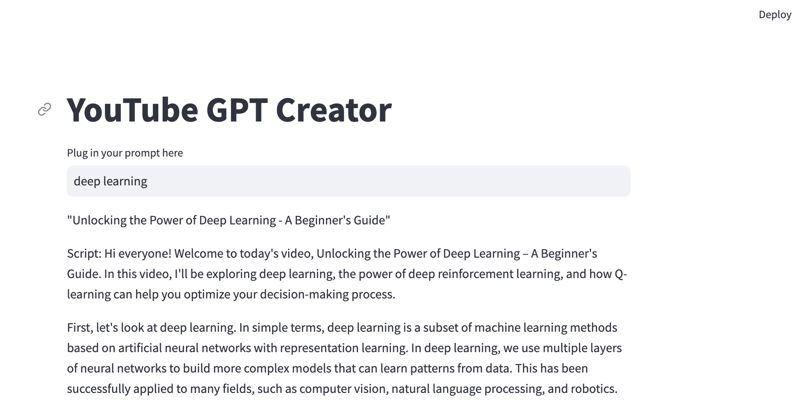

# AutoGPT
This is a YouTube GPT Creator. It connected to the OpenAI API and wiki page to generate the answers. 

## Set up the environment 
`pip install streamlit langchain openai wikipedia chromadb tiktoken`

run the website: 
`streamlit run app.py`
